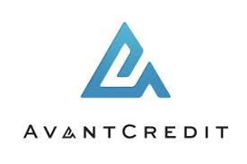

<h1 align="center" style="color:#2382ce;"> AVANT</h1>

A credit company website built with JavaScript

## Table of Contents 
* [Project Status](#project-status)
* [Features](#features)
* [Technologies](#technologies)
* [Project Collaborators](#contact)
* [Project link](https://github.com/Amram1997/avant-js-project.git)

## Project Status  

This project is currently: *Complete*

## Features 
 

-  ### Main page > Home 
Returns link to the main page of the website

-  ### Main page > Financial Calculator 
Financial calculation tools with features of :
-  Financial Calculator > Borrowing and Investment
>> - *Loan Calculator*
>>> Has 3 input fields: Loan amount, interest rate and years. Calculation result has 3 fields: Monthly Payment, Total Payment and Total Interest.
>> - *Mortgage Calculator*
>> - *Deposit Calculator*
-  Financial Calculator > Salary Calculator
>> - *Salary Calculator*
-  Financial Calculator > Financial Ratios
>> - *Financial Ratios*
-  ### Main page > Contact
Has input features with fields of contact person *email address* and *message*. 
-  ### *Main page > Apply in Minutes*
Has *registration* field with input names of:
>> - *First name*
>> - *Last name*
>> - *Email*
>> - *Password*
>> - *Date*
>> - *Password(with double confirmation)*

## Technologies  

Built with:
- HTML
- CSS
- JAVASCRIPT
## Project Collaborators 

This is a **Frontend Bootcamp** project, that provided by **Armenian Code Academy** and was implemented by:
 Name | Github link |
| ----------- | ----------- |
| Vahe Hakobyan | [vahehak93](https://github.com/vahehak93) |
| Amram Ananyan | [Amram1997](https://github.com/Amram1997) |
| Narek Ghazazyan | #TODO |
